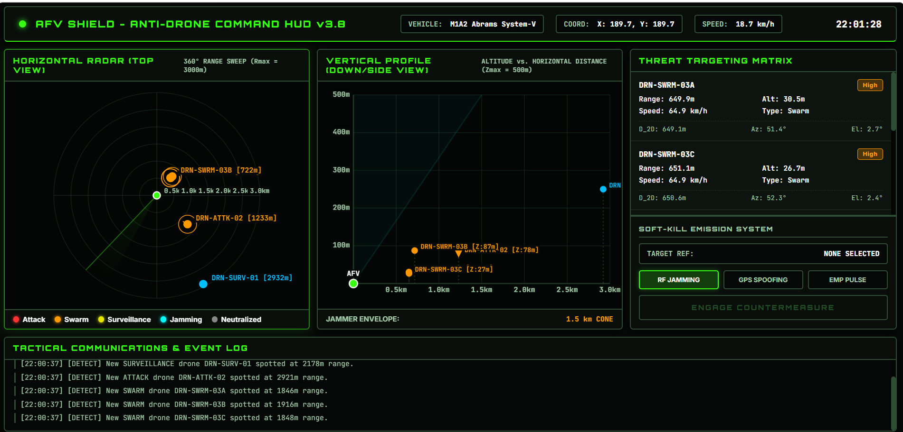

# Counter System for Military Vehicles (AFVs)

<div align="center">


**High-Fidelity Real-Time Tactical Drone Threat Detection & Countermeasure Simulation**

</div>

---

# Overview

The **Counter System for Military Vehicles (AFVs)** is a high-performance tactical simulation platform built using **Rust** with an interactive **Web Dashboard**.

The system simulates hostile drones approaching an Armored Fighting Vehicle (AFV), continuously tracking their movement in **3D space**, calculating telemetry, estimating threat levels, and enabling operators to deploy **Soft Kill (RF Jamming)** countermeasures.

This project focuses on **simulation, visualization, and AI-assisted threat analysis** for research, educational, and software engineering purposes.

<br><br>



</div>

# Features

## Drone Simulation

- Real-time drone spawning
- Multiple drone categories
  - Surveillance Drone
  - Attack Drone
  - Swarm Drone
- Randomized trajectories
- Velocity simulation
- Altitude variation
- Continuous movement updates (10Hz)
---

##  Threat Detection

- Automatic drone tracking
- 3D position estimation
- Distance calculation
- Heading calculation
- Elevation angle calculation
- Velocity estimation
- Threat scoring

---

## Countermeasure Simulation

Supported countermeasures include

### Soft Kill (RF Jamming)

When activated

- RF beam projects toward target
- Drone enters signal interception state
- Navigation failure simulated
- Drone rapidly loses altitude
- Drone crashes
- Status changes to **Neutralized**

---
# Simulation Pipeline

```
Spawn Drone
      │
      ▼
Update Position
      │
      ▼
Calculate Telemetry
      │
      ▼
Estimate Threat Score
      │
      ▼
Display on Dashboard
      │
      ▼
Operator Triggers Countermeasure
      │
      ▼
Drone Neutralized
```
---
# Mathematical Formulations

For every detected drone located at

```
(X, Y, Z)
```

relative to the AFV at

```
(0,0,0)
```

---

## 1. 3D Euclidean Distance

\[
D_{3D}=\sqrt{X^2+Y^2+Z^2}
\]

Measures the actual distance from the AFV.

---

## 2. Horizontal Distance

\[
D_{2D}=\sqrt{X^2+Y^2}
\]

Used for radar projection.

---

## 3. Azimuth Angle

\[
\theta=\operatorname{atan2}(Y,X)
\]

Converted into degrees

\[
\theta=\theta\times\frac{180}{\pi}
\]

Normalized

```
0° – 360°
```

---

## 4. Elevation Angle

\[
\phi=\operatorname{atan2}(Z,D_{2D})
\]

Represents the vertical angle of approach.

---

## 5. Threat Score

\[
Threat=w_d\left(1-\frac{D_{3D}}{D_{max}}\right)+
w_v\left(\frac{V}{V_{max}}\right)+Modifier(Type)
\]

Where

| Variable | Description |
|-----------|-------------|
| wd | Distance Weight |
| wv | Velocity Weight |
| Dmax | Maximum Detection Range |
| V | Drone Velocity |
| Vmax | Maximum Velocity |
| Modifier | Drone Type Modifier |

Drone modifiers

| Drone Type | Modifier |
|------------|-----------|
| Surveillance | Low |
| Attack | Medium |
| Swarm | High |

---

#  Telemetry

Each tracked drone continuously broadcasts

```
Drone ID

Drone Type

X Coordinate

Y Coordinate

Z Coordinate

3D Distance

Horizontal Distance

Speed

Heading

Elevation

Threat Score

Current Status

Target Lock

Countermeasure State
```
---

## Vertical Profile

Displays

- Drone altitude
- Terrain reference
- Jamming effects
- Crash trajectory
---

## Clone

```bash
git clone 
```

## Build

```bash
cargo build
```

---

## Run

```bash
cargo run
```

---

Open

```
http://localhost:8080
```

---

```bash
cargo check
```

Ensures source code compiles successfully.

---

### Release Build

```bash

cargo build --release

```

Generates optimized production binaries.

---

### Unit Tests

```bash
cargo test
```
---

#  Manual Verification

Run the application

```
cargo run
```

Open

```
http://localhost:8080
``

Trigger **Soft Kill**

Expected behavior

- Jamming vector projects from the AFV
- Drone status changes to **Signal Intercepted**
- Drone begins rapid descent
- Drone crashes
- Status updates to **Neutralized**

---
